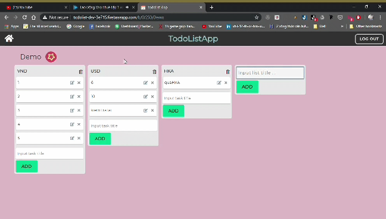
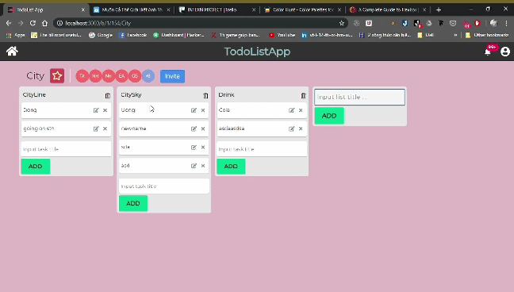
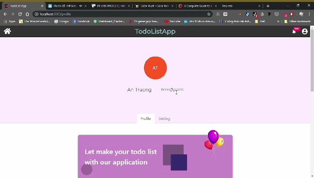

<h1 align="center">TodoList</h1>
<p>We are gonna create a small Todolist App like Trello</p>

<div align="center">

<a href="https://github.com/AnTruongQuoc/TodoListApp/stargazers"></a>
<a href="https://github.com/AnTruongQuoc/TodoListApp/network/members"></a>
<a href="https://github.com/AnTruongQuoc/TodoListApp/graphs/contributors"></a>
<a href="https://github.com/AnTruongQuoc/TodoListApp/blob/master/LICENSE"></a>

<div style="display: flex; flex-direction:column; justify-content: space-around; ">
  <h5>Add Task Dashboard</h5>
  
  <h5>Invite member</h5>
  
  <h5>User Profile</h5>
  
</div>
</div>


<!-- INSTALLATION -->
## Installation

Clone this repository and import into Android Studio
   ```sh
   git clone https://github.com/AnTruongQuoc/TodoListApp.git
   ```
   
## Languages and Tools


<br />
<br />
---

## Contact
* Truong Quoc An - tqan.work@gmail.com
